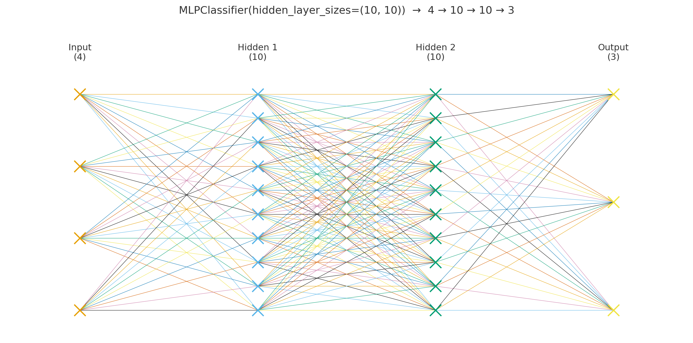

# iris 데이터를 분류하는 인공신경망 모델  

## 알아야 하는 개념  
### 1. iris  데이터셋 기본  
**MLPClassifier**는 분류에서 `클래스 개수 = 출력 뉴런 수`로 맞춘다. (출력층은 소프트맥스)  
- iris.data         : (150, 4) 실수 특징  
- iris.target       : (150,) 정수 레이블 벡터 {0, 1, 2}  
  - `(150,)` 표기는 **1차원 배열**에 원소가 150개 라는 뜻  
  - `(150,1)` 은 **2차원**(150행 1열) 열 벡터
    - 3 classes : (150,)은 넘파이 배열의 모양을 나타내는 표기이며, 뒤의 쉼표는 차원이 1개임을 보여주는 것이므로 1차원 배열에 원소가 150개라는 의미이다. 만약 (150, 1) 이 된다면 2차원(2D), 150행 1열의 세로(열) 벡터가 된다.  
- iris.target_names : 레이블 이름 배열 → ['setosa', 'versicolor', 'virginica']  
- **분류 출력 크기**: 클래스 개수(=3) → 출력 유닛 3개(softmax 확률)  

### 2. 데이터 분할 관련  
- **train** : 모델이 학습하는 데이터  
- **validation** : 학습 중 성능을 확인/튜닝(조기 종료 등)에 쓰는 데이터  
- **test** : 최종 성능 확인용(학습/튜닝에 사용 금지)  
- `train_test_split(..., test_size=0.2)` → **8:2 분할** (예: 120/30)  
- `random_state` (=seed 고정)  
  - 데이터를 섞는 순서(분할 결과)나 초기 가중치 등의 **난수성을 고정**해 **재현성** 확보  
  - 예: `train_test_split(..., ramdom_state=42)`, `MLPClassifier(..., random_state=42)`  

### 3. 학습 루프의 구성 요소  
- **epoch** : **훈련 데이터 전체를 1바퀴** 다 학습한 것  
  - Keras `fit(epoch=E)` → 정확히 E번  
  - scikit-learn의 `MLPClassifier(max_iter=...)`:  
    - `solver='adam'` / `sgd`일 때 **데이터에 대한 반복 횟수(에폭 수와 유사)** 의미  
- **batch(미니배치)** : 한 번의 가중치 업데이트에 사용하는 **데이터 묶음** (작을수록 자주 고치고, 클수록 안정적이다.)  
- **batch_size** :  
  - *Keras* : `fit(..., batch_size=32)` 처럼 직접 지정  
  - scikit-learn MLP : 기본 `batch_size='auto'` (보통 `min(200, n_samples)`)  
- **shuffle** : 매 epoch마다 데이터를 섞어 학습 안정화(일반화) 도움  

### 4. 손실/역전파/지표  
- **loss(손실)** : 모델의 틀린 정도  
  - 다중분류 : **크로스피엔트로피**(Keras: `categorical_crossentropy` / `sparse_categorical_crossentropy`, scikit-learn MLP: **log_loss** 내부 사용)  
  - `sparse_categorical_crossentropy`: **정수 레이블**에 사용 (원-핫 필요 없음)  
  - `categorical_crossentropy`: **원-핫 레이블**에 사용  
- **backprop(역전파)** : 손실을 줄이도록 각 가중치의 **기울기(gradient)** 계산  
- **optimizer(최적화)** : 가중치 업데이트 규칙 (예: *Adam*, SGD)  
  - **learning rate**가 너무 크면 발산, 너무 작으면 수렴이 느림  
- **accuracy(정확도)** : `맞춘 개수 / 전체 개수`  
  - Keras `metrics=['accuracy']`면 `evaluate`가 `[loss, accuracy]` 반환  
  - scikit-learn은 `model.score(X, y)`가 정확도  

### 5. 검증/조기종료 (early stopping)  
- **validation_split** :  
  - *Keras* `fit(validation_split=0.2)` → 훈련 데이터 중 **20%를 검증**으로 자동 분리  
  - scikit-learn MLP는 `early_stooping=True` 일 때 내부적으로 `validation_fraction` (기본 0.1)을 사용  
- **patience** :  
  - 개선이 없더라도 몇 epoch 더 기다릴지 **  
  - 예: `EarlyStopping(monitor='val_loss', patience=10, restore_best_weights=True)`  
- **val_accuracy / val_loss** : 검증 세트에 대한 정확도/손실(과적합 진단에 유용)  

### 6. 모델 구조/활성화/정규화  
- **units(유닛)** = 뉴런 1개, `Dense(units=N)` → 출력 차원 `N`  
- **activation(활성화)** :  
  - **ReLU**(기본, 빠르고 효과적), **sigmoid**(출력이 0~1), **softmax**(다중분류 확률)  
- **regularization(정규화)** :  
  - scikit-learn MLP의 `alpha`는 **L2 규제 세기**(과적합 완화)  
  - Keras에서도 `kernel_regularizer=l2(...)`, `dropout` 등 사용 가능  
- **스케일링(중요)** :  
  - MLP는 입력 스케일에 민감 → **표준화** 권장 (`StandardScaler` 파이프라인)  

### 7. 예측과 해석  
- **predict** : 각 샘플의 **클래스 라벨** (Iris에선 0/1/2)  
- **predict_proba** : 각 클래스의 **확률 벡터**(softmax 출력, 합=1)  
- **confusion matrix(혼동행렬)** : **실제 vs 예측** 빈도표(대각선=정답, 비대각=오분류)  
- (필요시) **precision/recall/F1**로 클래스별 성능 확인  

> *Tips*:  
> - **재현성**이 중요하면 데이터 분할과 모델 둘 다 `random_state`를 고정하세요.  
> - scikit-learn MLP를 쓸 땐 **입력 표준화**(예: `make_pipeline(StandardScaler(), MLPClassifier(...))`)가 수렴/성능에 크게 도움됩니다.  
<br>
<br>


## 중요한 하이퍼파라미터(hyper parameters)/기본값  
```
hidden_layer_sizes=(10,10): 은닉층 구조  
activation='relu': 활성화 함수  
solver='adam': 최적화 방식(작은/중간 데이터에 적합)  
alpha=1e-4: L2 규제(과적합 완화)  
max_iter=1000: 최대 반복 수  
random_state=None: 가중치 초기화가 매 실행 달라질 수 있음 → 재현성 원하면 random_state=42 지정  
```
<br>
<br>


## 코드 상세 해설  
### 1 cell  
```
from sklearn.neural_network import MLPClassifier
from sklearn.datasets import load_iris
from sklearn.model_selection import train_test_split

iris = load_iris()
# print(iris)

model = MLPClassifier(hidden_layer_sizes=(10, 10), max_iter=1000)
X_train, X_test, y_train, y_test = train_test_split(iris.data, iris.target, test_size=0.2, random_state=42)
model.fit(X_train, y_train)
print("model accuracy:", model.score(X_test, y_test))
print("Predictions:", model.predict(X_test))
```
**무엇을 하는 코드인가?**
1. Scikit-learn의 MLPClassifier(다층 퍼셉트론)로 Iris(붓꽃) 데이터셋을 학습한다.  
2. 학습/테스트 분리 → 학습 → 정확도(accuracy) 평가 → 클래스 예측값 출력한다.  
<br>

`from sklearn.~`  
분류용 다층퍼셉트론(MLPClassifier), iris 데이터 로더(load_iris), 데이터  분할 유틸(train_test_split)을 불러온다.  

`iris = load_iris()`  
데이터셋을 로드한다.  

`model = MLPClassifier(hidden_layer_sizes=(10, 10), max_iter=1000)`  
MLP 분류기를 생성한다.  
- `iris.data` 입력 특성이 4개여서, input 뉴런은 4개로 시작한다.  
- `hidden_layer_sizes=(10, 10)` 은 은닉층 2개이며, 각 10개의 뉴런을 생성한다.  
- `iris.target` 출력 특성이 3개여서, output 뉴런은 3개가 된다.  
  
- 최대 반복 1000 epoch(정확히는 scikit-learn의 반복 스텝)  
- 기본값은 아래와 같다.  

| key                | value    |
| ------------------ | -------- |
| activation         | relu     |
| solver             | adam     |
| alpha              | 1e-4(L2) |
| learning_rate_init | 1e-3     |
| early_stopping     | False    |
| random_state       | None     | 

`X_train, X_test, y_train, y_test = train_test_split(iris.data, iris.target, test_size=0.2, random_state=42)`  
**iris.data**와 **iris.target**에는 150개의 샘플이 있고, test_size=0.2 는 테스트 비율이 **20%**라는 것을 의미한다.  
20% 즉 8:2 비율로 분할하면 150개의 샘플의 테스트는 30개가 된다. (학습 120, 테스트 30)  
(ps. _test_size_를 정수로 주면 정확히 그 개수만큼 테스트로 사용한다. ex: _test_size=30_)  
`random_state=42` → 항상 같은 분할을 사용하도록 랜덤한 동작의 seed를 고정한다. `train_test_split`은 데이터를 섞어서(셔플) 학습/테스트를 나누는데, 이때 쓰는 난수 생성기의 시작값(seed)을 42로 고정하면 항상 같은 방식으로 섞이기 때문에 매번 같은 분할 결과(같은 샘플이 학습/테스트로 감)를 얻는다. : 같은 코드/데이터로 항상 같은 결과를 얻기 위한 재현성 필요시 사용한다. ex, 실험 기록/비교  

`model.fit(X_train, y_train)`  
신경망 학습을 시작한다. 예측 > 틀린 것 확인(loss) > 수정(가중치 업데이트) 순서를 계속해서 반복한다.  
1. 데이터를 섞고(shuffle) Adam 옵티마이저로 미니배치 단위로 나눠서 처리한다.  
2. 예측 `순전파, forward`  
- 입력(4) → 은닉층(10) → 은닉층(10) → 출력(3) 순서로 값을 보내 각 클래스 확률을 계산한다.  
3. 오차 확인 `loss`  
- 예측과 정답(y_train)을 비교해서 오차(loss)를 구한다.  
4. 오차 추적 `역전파, backprop`  
- 오차가 각 가중치, 바이어스에 얼마나 영향을 받았는지에 대한 기울기를 계산한다.  
5. 업데이트  
- Adam 옵티마이저가 기울기만큼 가중치/바이어스를 살짝 변경한다.  
- 여러 배치, 여러 번 반복한다.  
위 과정을 계속 반복할수록 오차가 점점 적어져 정답 클래스의 점수(확률)가 올라가도록 조정된다.  

`print("model accuracy:", model.score(X_test, y_test))`  
테스트셋 **정확도**를 출력한다. (score는 기본으로 accuracy를 반환)  
출력은 0과 1 사이의 실수이며, `맞춘 개수 / 전체 개수`로 계산한다.  

`print("Predictions:", model.predict(X_test))`  
테스트셋에 대한 **예측 레이블 배열**을 출력한다.  
출력은 `길이 = 테스트 샘플 수`이고, 각 레이블의 숫자(0, 1, 2)는 품종 클래스를 의미한다.  
> 클래스 이름으로 보고 싶다면 `names = iris.target_names` 을 사용한다.  
> > 클래스 이름 : ['setosa', 'versicolor', 'virginica']   
<br>

💡 **Point!**
- score() = 정확도 = 맞춘비율  
- predict() = 각 샘플의 예측 클래스 배열  
<br>


### 2 cell
```
from sklearn.metrics import confusion_matrix
print("Confusion Matrix:\n", confusion_matrix(y_test, model.predict(X_test)))
```
**무엇을 하는 코드인가?**  
1. confusion matrix를 계산해서 출력한다.  
2. `X_test`에 대한 예측 레이블을 즉석에서 만들고(`model.predict(X_test)`), 그 예측과 실제 정답 `y_test`를 비교해 confusion matrix를 계산한 뒤 출력한다.  
3. confusion matrix는 행=실제 클래스, 열=예측 클래스 이며, 각 칸은 해당 조합의 개수이다.  
<br>

`from sklearn.matrix import confusion_matrix`  
scikit-learn의 metrics 모듈에서 confusion_matrix를 가져와서, confusion_matrix(...)를 직접 호출할 수 있게 된다.  
`print("Confusion Matrix:\n", confusion_matrix(y_test, model.predict(X_test)))`  
- 실행 순서  
  - `model.predict(X_test)` → 테스트셋 각 샘플의 예측 레이블 배열을 만든다.  
  - `confusion_matrix(y_test, <예측배열>)` → 행 = 실제 레이블(y_test), 열 = 예측 레이블 기준의 **빈도표(정수 행렬)**를 계산한다.  
    - 크기 : `n_classes x n_classes` (iris는 보통 3x3)  
    - 대각선 = 맞춘 개수, 대각선 밖 = 오분류 개수  
    - 레이블 순서는 기본적으로 정렬된 고유값 순서를 사용한다.  
<br>


### 3 cell
```
from tensorflow.keras import Sequential
from tensorflow.keras.layers import Dense, Input

model = Sequential()
model.add(Input(shape=(4,))) # input layer
model.add(Dense(50, activation='sigmoid')) # hidden layer
model.add(Dense(30, activation='sigmoid')) # hidden layer
model.add(Dense(3, activation='softmax')) # output layer
model.summary()
```
<br>

**무엇을 하는 코드인가?**  
1. Keras로 다층 퍼셉트론(MLP) 분류 모델의 구조만 정의하고 요약을 출력한다.  
<br>

`from tensorflow.keras import Sequential`  
Keras의 Sequential 클래스는 layer들을 **위에서 아래로 순차적으로** 쌓는 모델을 만들 때 사용한다.  

`from tensorflow.keras.layers import Dense, Input`  
Dense : 완전 연결(fully connected) 층  
Input : 입력 텐서의 모양(shape)을 선언하는 층(배치 차원 제외)  

`model = Sequential()`  
빈 Sequential 모델을 생성한다. 이제 add()로 층을 차례대로 붙일 수 있다.  

`model.add(Input(shape=(4,)))`  
입력의 형상을 지정한다. 각 샘플은 길이 4의 벡터를 갖는다.  
배치 차원은 제외하므로, 실제 입력 모양은 `(batch_size, 4)`가 된다.  
여기서는 학습 파라미터인 가중치를 갖지 않는다.  

`model.add(Dense(50, activation='sigmoid'))`  
유닛 50개의 은닉층을 추가한다.  
활성화 함수는 `sigmoid`이며, 이전 층의 모든 뉴런과 완전 연결된다.  

`model.add(Dense(30, activation='sigmoid'))`  
유닛 30개의 두 번째 은닉층으로, 활성화 함수는 `sigmoid`이다.  

`model.add(Dense(3, activation='softmax'))`  
유닛 3개의 출력층, `softmax`로 각 클래스의 확률(합=1)을 출력한다.  
보통 3-classses 분류 문제를 대응할 때 이러한 형태를 사용한다.  

`model.summary()`  
모델 구조 요약을 출력한다. - 각 층의 출력 형태, 파라미터 수, 총 파라미터 수 등.  

- 참고) 파라미터 수 계산 예시
  - Dense(50) : (입력 4 x 유닛 50) + 바이어스 50 = 4*50 + 50 = 250  
  - Dense(30) : (50 x 30) + 30 = 1530  
  - Dense(3)  : (30 x 3) + 3 = 93  
  - 총합 : 250 + 1530 + 93 = 1873 (Input층은 파라미터가 없다.)  
    - 여기서 유닛(unit)이란 뉴런(node) 1개를 의미한다.  


### 4 cell
```
model.compile(optimizer='adam', loss='sparse_categorical_crossentropy', metrics=['accuracy'])
model.fit(X_train, y_train, epochs=100, batch_size=50)
```
<br>

**무엇을 하는 코드인가?**  
1. `학습 규칙(최적화/손실/지표)`을 설정하여 어떤 지표(accuracy)로 모델을 훈련·평가할지 지정한다.  
2. 훈련 데이터를 배치 크기 50으로 나눠 100 에폭 동안 반복 학습하며, 손실을 줄이도록 가중치/바이어스를 업데이트하여 실제 학습을 실행한다.  
<br>

`model.compile(optimizer='adam', loss='sparse_categorical_crossentropy', metrics=['accuracy'])`  
어떤 방식으로 학습·평가할지 ㄹ지정하여 훈련 설정을 고정한다.  
- `optimizer='adam'`  
  - Adam 옵티마이저를 사용하여 역전파로 계산한 기울기를 이용해 가중치/바이어스를 업데이트한다.  
- `loss='sparse_categorical_crossentropy'`  
  - 다중 클래스 분류용 크로스엔트로피를 손실한다.  
  - 정수 레이블을 바로 넣을 때 사용한다.  
  - 레이블이 원-핫 벡터라면 categorical_crossentropy를 써야 한다.  
- `metrics=['accuracy']`  
  - 훈련(및 검증/평가) 시 정확도를 함께 계산해 로그에 보여준다.

`model.fit(X_train, y_train, epochs=100, batch_size=50)`  
실제 학습을 수행한다.  
- `epochs=100`
  - 훈련 데이터를 100번 반복한다.  
- `batch_size=50`
  - 훈련 데이터를 한 번에 50개씩 미니배치로 나눠 업데이트한다.  
  - (iris 예시에서 X_train이 120개라면) 에폭당 스텝 수 = ceil(120/50) = 3  
    - 100 에폭이면 총 약 300번(3x100) 파라미터 업데이트가 일어난다.  
    - 마지막 배치는 20개로 자동 처리된다.  


### 5 cell
```
print(model.evaluate(X_test, y_test))
```
<br>

학습된 Keras 모델을 테스트셋으로 평가한다.  
컴파일에서 지정한 loss와 metrics를 계산하고, 설정된 `metrics=['accuracy']` 기준으로 `test_loss, test_accuracy`를 반환한다.  
그 후 `print(..)`로 그 값을 그대로 출력한다.  
<br>


### 6 cell
```
model.save('iris_model.keras')
```
<br>

현재 keras 모델을 파일로 저장한다. Kears 3의 권장 포맷인 `.keras`(zip기반 단일 파일)로 저장한다.  
저장되는 사항은 아래와 같다.  
- 모델 구조(레이어/하이퍼파라미터)  
- 가중치/바이어스 값  
- 훈련 설정(loss, optimizer, metrics)  
- 옵티마이저 상태(학습을 이어서 재개 가능)  
현재 직업 디렉터리에 `iris_model.keras`라는 파일로 저장된다. (같은 이름의 파일이 있으면 덮어쓰기)  
**주의: `.h5`(HDF5)와 서로 호환되지 않으니 단순히 확장자만 바꿔 쓰면 안 된다.**
<br>


### 7 cell
```
from tensorflow.keras.models import load_model
loaded_model = load_model('iris_model.keras')
```
<br>

Keras에서 저장된 모델을 파일로부터 복원하는 함수 load_model을 가져온다.  
현재 작업 디렉터리에 있는 `iris_model.keras`파일을 읽어 모델을 메모리로 복원해 loaded_model 변수에 담는다.  
모델 구조, 가중치/바이어스, compile 설정(loss/metrics/optimizer), 옵티마이저 상태 등이 복원된다.  
<br>


### 8 cell
```
from sklearn.datasets import load_iris
from sklearn.model_selection import train_test_split
iris = load_iris()
X_train, X_test, y_train, y_test = train_test_split(iris.data, iris.target, test_size=0.2, random_state=42)

print(loaded_model.evaluate(X_test, y_test))
```
<br>

**무엇을 하는 코드인가?**  
1. 저장해 둔 Keras모델(loaded_model)을 iris 테스트셋으로 평가해서 성능을 확인하는 코드다.  
2. 순서  
- iris 데이터 불러오기 -> 학습/테스트 8:2 분할(재현성 위해 random_state=24)  
- `loaded_model.evaluate(X_test, y_test)`로 손실과 정확도를 계산  
- `print(..)`로 `test_loss, test_accuracy` 출력  
<br>

`from sklearn.datasets import load_iris`  
scikit-learn 내장 iris 데이터셋을 불러오는 함수 `load_iris`를 import한다.  

`from sklearn.model_selection import train_test_split`  
데이터셋을 학습용/테스트용으로 분리하는 유틸리티 함수 `train_test_split`을 import한다.  

`iris = load_iris()`  
iris 데이터셋을 메모리로 로드해서 iris 변수에 저장한다.  
주요 속성으로는 `iris.data`(형상 `(150, 4)`인 특징), `iris.target`(형상 `(150,)`인 정수 레이블 0/1/2)이 있다.  

`X_train, X_test, y_train, y_test = train_test_split(iris.data, iris.target, test_size=0.2, random_state=42)`  
특징과 레이블을 훈련/테스트로 8:2 비율로 나눈다.  
전체 150개 중 훈련 120, 테스트 30개가 된다.  
`random_state=42`로 셔플 시드를 고정해 항상 같은 분할을 얻는다.  

`print(loaded_model.evaluate(X_test, y_test))`  
저장되어 있던 Keras 모델 `loaded_model`을 테스트셋으로 평가한다.  
`complie`때 지정된 **손실(loss)**과 **지표(metrics)**를 계산해 리스트로 반환한다.  
- 이 때 모델은 `metrics=['accuracy']`였으므로 반환은 `[test_loss, test_accuracy]`.  
`print(..)`로 그 값을 그대로 출력한다.  