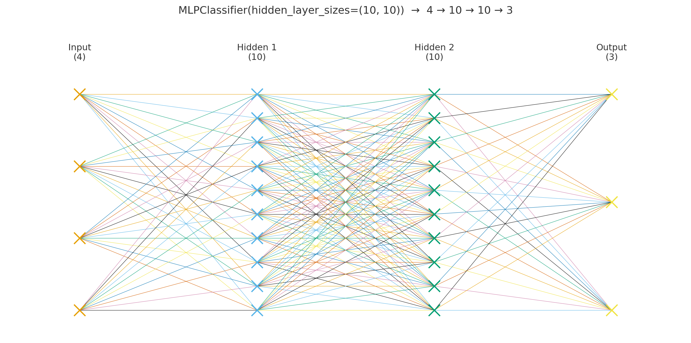

# iris 데이터를 분류하는 인공신경망 모델  

## 알아야 하는 개념  
#### 1. iris  
**MLPClassifier**는 분류에서 `클래스 개수 = 출력 뉴런 수`로 맞춘다. (출력층은 소프트맥스)
- iris.data         : (150, 4) 실수 특징  
- iris.target       : (150,) 정수 레이블 {0, 1, 2} → 3 classes : (150,)은 넘파이 배열의 모양을 나타내는 표기이며, 뒤의 쉼표는 차원이 1개임을 보여주는 것이므로 1차원 배열에 원소가 150개라는 의미이다. 만약 (150, 1) 이 된다면 2차원(2D), 150행 1열의 세로(열) 벡터가 된다.  
- iris.target_names : 레이블 이름 배열 → ['setosa', 'versicolor', 'virginica']  

patience  
train  
validation_split  
epochs : 전체 데이터를 한 바퀴 다 학습하면 1 에폭  
batch : 한 번에 학습에 쓰는 묶음 (작을수록 자주 고치고, 클수록 안정적이다.)  
loss : 틀린 정도 (오차 : 낮을수록 좋음)  
backprop : 역전파, 어떤 가중치를 어떻게 고쳐야 로스가 줄지 계산하는 절차  
accuracy 정확도  

batch_size  
callbacks  
val_accuracy  
<br><br>

## 중요한 하이퍼파라미터(hyper parameters)/기본값  
hidden_layer_sizes=(10,10): 은닉층 구조  
activation='relu': 활성화 함수  
solver='adam': 최적화 방식(작은/중간 데이터에 적합)  
alpha=1e-4: L2 규제(과적합 완화)  
max_iter=1000: 최대 반복 수  
random_state=None: 가중치 초기화가 매 실행 달라질 수 있음 → 재현성 원하면 random_state=42 지정  
<br><br>

## 코드 상세 해설  
### 1 cell  
```
from sklearn.neural_network import MLPClassifier
from sklearn.datasets import load_iris
from sklearn.model_selection import train_test_split

iris = load_iris()
# print(iris)

model = MLPClassifier(hidden_layer_sizes=(10, 10), max_iter=1000)
X_train, X_test, y_train, y_test = train_test_split(iris.data, iris.target, test_size=0.2, random_state=42)
model.fit(X_train, y_train)
print("model accuracy:", model.score(X_test, y_test))
print("Predictions:", model.predict(X_test))
```
**무엇을 하는 코드인가?**
1. Scikit-learn의 MLPClassifier(다층 퍼셉트론)로 Iris(붓꽃) 데이터셋을 학습한다.  
2. 학습/테스트 분리 → 학습 → 정확도(accuracy) 평가 → 클래스 예측값 출력한다.  
<br>

`from sklearn.~`  
분류용 다층퍼셉트론(MLPClassifier), iris 데이터 로더(load_iris), 데이터  분할 유틸(train_test_split)을 불러온다.  

`iris = load_iris()`  
데이터셋을 로드한다.  

`model = MLPClassifier(hidden_layer_sizes=(10, 10), max_iter=1000)`  
MLP 분류기를 생성한다.  
- `iris.data` 입력 특성이 4개여서, input 뉴런은 4개로 시작한다.  
- `hidden_layer_sizes=(10, 10)` 은 은닉층 2개이며, 각 10개의 뉴런을 생성한다.  
- `iris.target` 출력 특성이 3개여서, output 뉴런은 3개가 된다.  
  
- 최대 반복 1000 epoch(정확히는 scikit-learn의 반복 스텝)  
- 기본값은 아래와 같다.  

| key                | value    |
| ------------------ | -------- |
| activation         | relu     |
| solver             | adam     |
| alpha              | 1e-4(L2) |
| learning_rate_init | 1e-3     |
| early_stopping     | False    |
| random_state       | None     | 

`X_train, X_test, y_train, y_test = train_test_split(iris.data, iris.target, test_size=0.2, random_state=42)`  
**iris.data**와 **iris.target**에는 150개의 샘플이 있고, test_size=0.2 는 테스트 비율이 **20%**라는 것을 의미한다.  
20% 즉 8:2 비율로 분할하면 150개의 샘플의 테스트는 30개가 된다. (학습 120, 테스트 30)  
(ps. _test_size_를 정수로 주면 정확히 그 개수만큼 테스트로 사용한다. ex: _test_size=30_)  
`random_state=42` → 항상 같은 분할을 사용하도록 랜덤한 동작의 seed를 고정한다. `train_test_split`은 데이터를 섞어서(셔플) 학습/테스트를 나누는데, 이때 쓰는 난수 생성기의 시작값(seed)을 42로 고정하면 항상 같은 방식으로 섞이기 때문에 매번 같은 분할 결과(같은 샘플이 학습/테스트로 감)를 얻는다. : 같은 코드/데이터로 항상 같은 결과를 얻기 위한 재현성 필요시 사용한다. ex, 실험 기록/비교  

`model.fit(X_train, y_train)`  
신경망 학습을 시작한다. 예측 > 틀린 것 확인(loss) > 수정(가중치 업데이트) 순서를 계속해서 반복한다.  
1. 데이터를 섞고(shuffle) Adam 옵티마이저로 미니배치 단위로 나눠서 처리한다.  
2. 예측 `순전파, forward`  
- 입력(4) → 은닉층(10) → 은닉층(10) → 출력(3) 순서로 값을 보내 각 클래스 확률을 계산한다.  
3. 오차 확인 `loss`  
- 예측과 정답(y_train)을 비교해서 오차(loss)를 구한다.  
4. 오차 추적 `역전파, backprop`  
- 오차가 각 가중치, 바이어스에 얼마나 영향을 받았는지에 대한 기울기를 계산한다.  
5. 업데이트  
- Adam 옵티마이저가 기울기만큼 가중치/바이어스를 살짝 변경한다.  
- 여러 배치, 여러 번 반복한다.  
위 과정을 계속 반복할수록 오차가 점점 적어져 정답 클래스의 점수(확률)가 올라가도록 조정된다.  

`print("model accuracy:", model.score(X_test, y_test))`  
테스트셋 **정확도**를 출력한다. (score는 기본으로 accuracy를 반환)  
출력은 0과 1 사이의 실수이며, `맞춘 개수 / 전체 개수`로 계산한다.  

`print("Predictions:", model.predict(X_test))`  
테스트셋에 대한 **예측 레이블 배열**을 출력한다.  
출력은 `길이 = 테스트 샘플 수`이고, 각 레이블의 숫자(0, 1, 2)는 품종 클래스를 의미한다.  
> 클래스 이름으로 보고 싶다면 `names = iris.target_names` 을 사용한다.  
> > 클래스 이름 : ['setosa', 'versicolor', 'virginica']   
<br> 

### 2 cell
```
from sklearn.metrics import confusion_matrix
print("Confusion Matrix:\n", confusion_matrix(y_test, model.predict(X_test)))
```
<br>

### 3 cell
```
from tensorflow.keras import Sequential
from tensorflow.keras.layers import Dense, Input

model = Sequential()
model.add(Input(shape=(4,))) # input layer
model.add(Dense(50, activation='sigmoid')) # hidden layer
model.add(Dense(30, activation='sigmoid')) # hidden layer
model.add(Dense(3, activation='softmax')) # output layer
model.summary()
```
<br>

### 4 cell
```
model.compile(optimizer='adam', loss='sparse_categorical_crossentropy', metrics=['accuracy'])
model.fit(X_train, y_train, epochs=100, batch_size=50)
```
<br>

### 5 cell
```
print(model.evaluate(X_test, y_test))
```
<br>

### 6 cell
```
model.save('iris_model.keras')
```
<br>

### 7 cell
```
from tensorflow.keras.models import load_model
loaded_model = load_model('iris_model.keras')
```
<br>

### 8 cell
```
from sklearn.datasets import load_iris
from sklearn.model_selection import train_test_split
iris = load_iris()
X_train, X_test, y_train, y_test = train_test_split(iris.data, iris.target, test_size=0.2, random_state=42)

print(loaded_model.evaluate(X_test, y_test))
```